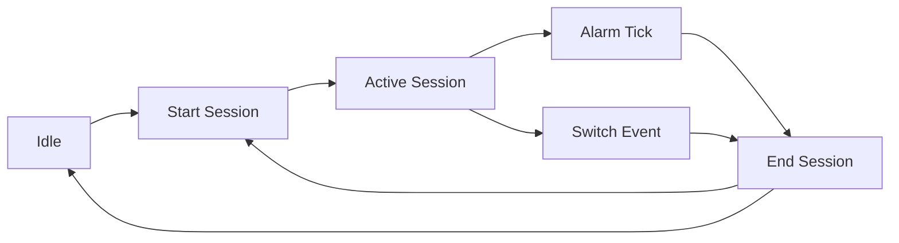

## Overview

The `SessionManager` class is the core component responsible for tracking active browsing sessions in LuminTime. It handles:

- **Debounced event handling** for rapid tab switches
- **Serialized queue processing** using AsyncQueuer to prevent race conditions
- **Periodic persistence** via browser alarms
- **Session lifecycle management** (start, end, transition)
- **URL blocking** to exclude certain domains from tracking

All session operations are queued and processed serially to ensure data consistency.

## Dependencies

- `@tanstack/pacer` - AsyncQueuer for serialized task processing
- Browser Extension APIs - `browser.alarms` for periodic saves
- Storage abstraction layer
- Database recording function

---

## Types

### ActiveSessionData

Represents an active browsing session in memory/storage.

```typescript
interface ActiveSessionData {
  url: string;
  title: string;
  startTime: number;
  lastUpdateTime: number;
  duration: number;
  eventSource?: EventSource;
}
```

<ParamField path="url" type="string" required>
  The URL being tracked in the current session
</ParamField>

<ParamField path="title" type="string" required>
  The page title of the current session
</ParamField>

<ParamField path="startTime" type="number" required>
  Unix timestamp (ms) when the session started
</ParamField>

<ParamField path="lastUpdateTime" type="number" required>
  Unix timestamp (ms) of the last session update
</ParamField>

<ParamField path="duration" type="number" required>
  Accumulated duration in milliseconds
</ParamField>

<ParamField path="eventSource" type="EventSource">
  Optional source identifier for the event that created this session (e.g., "alarm", "tab-switch")
</ParamField>

### SessionDependencies

Dependency injection interface for SessionManager.

```typescript
interface SessionDependencies {
  storage: {
    getValue: () => Promise<ActiveSessionData>;
    setValue: (val: ActiveSessionData) => Promise<void>;
    removeValue: () => Promise<void>;
  };
  recordActivity: (
    url: string,
    duration: number,
    title?: string,
    startTime?: number,
    eventSource?: EventSource,
  ) => Promise<void>;
  alarmName: string;
  alarmPeriodInMinutes: number;
  isUrlBlocked?: (url: string) => boolean;
}
```

<ParamField path="storage" type="object" required>
  Storage abstraction for persisting active session data
  
  <ParamField path="storage.getValue" type="() => Promise<ActiveSessionData>" required>
    Retrieve the current active session
  </ParamField>
  
  <ParamField path="storage.setValue" type="(val: ActiveSessionData) => Promise<void>" required>
    Persist the active session
  </ParamField>
  
  <ParamField path="storage.removeValue" type="() => Promise<void>" required>
    Clear the active session from storage
  </ParamField>
</ParamField>

<ParamField path="recordActivity" type="function" required>
  Function to record completed session activity to the database
  
  **Parameters:**
  - `url` (string) - The URL that was tracked
  - `duration` (number) - Total duration in milliseconds
  - `title` (string, optional) - Page title
  - `startTime` (number, optional) - Session start timestamp
  - `eventSource` (EventSource, optional) - Event source identifier
</ParamField>

<ParamField path="alarmName" type="string" required>
  Unique name for the browser alarm used for periodic saves
</ParamField>

<ParamField path="alarmPeriodInMinutes" type="number" required>
  Interval in minutes for periodic session persistence
</ParamField>

<ParamField path="isUrlBlocked" type="(url: string) => boolean">
  Optional callback to check if a URL should be excluded from tracking
</ParamField>

---

## Constructor

```typescript
const sessionManager = new SessionManager(deps: SessionDependencies)
```

Creates a new SessionManager instance with the provided dependencies.

<ParamField path="deps" type="SessionDependencies" required>
  Dependency injection object containing storage, recording function, alarm configuration, and optional URL blocker
</ParamField>

### Example

```typescript
import { SessionManager } from '@/utils/SessionManager';
import { storage } from 'wxt/storage';
import { recordActivity } from '@/db/services/activityService';

const sessionManager = new SessionManager({
  storage: {
    getValue: () => storage.getItem('local:activeSession') ?? {},
    setValue: (val) => storage.setItem('local:activeSession', val),
    removeValue: () => storage.removeItem('local:activeSession'),
  },
  recordActivity: recordActivity,
  alarmName: 'session-tick',
  alarmPeriodInMinutes: 1,
  isUrlBlocked: (url) => url.startsWith('chrome://'),
});
```

---

## Methods

### init()

Initializes the session manager by restoring the alarm if an active session exists.

```typescript
await sessionManager.init(): Promise<void>
```

<Warning>
  **Must be called once** after construction, typically in the background script initialization.
</Warning>

**Behavior:**
- Checks if there's a persisted active session
- If found, restores the alarm to continue periodic saves
- Sets internal `_hasActiveSession` flag

#### Example

```typescript
const sessionManager = new SessionManager(deps);
await sessionManager.init();
```

---

### handleEvent()

Main entry point for processing session events. All events are queued and processed serially.

```typescript
sessionManager.handleEvent(
  type: 'switch' | 'alarm' | 'idle',
  data?: { url: string | null; title?: string; eventSource?: EventSource }
): void
```

<ParamField path="type" type="'switch' | 'alarm' | 'idle'" required>
  The type of event to handle:
  
  - **`switch`** - Debounced tab switch or navigation (500ms debounce)
  - **`alarm`** - Periodic save triggered by browser alarm
  - **`idle`** - Immediate state change (window focus, system idle)
</ParamField>

<ParamField path="data" type="object">
  Snapshot of the target state
  
  <ParamField path="data.url" type="string | null">
    The new URL to track (null for no tracking)
  </ParamField>
  
  <ParamField path="data.title" type="string">
    The page title
  </ParamField>
  
  <ParamField path="data.eventSource" type="EventSource">
    Optional event source identifier
  </ParamField>
</ParamField>

#### Event Types Explained

**`switch` Events (Debounced)**
- Triggered by tab switches, URL navigation
- Debounced by 500ms to handle rapid switching
- Clears previous debounce timer on each call

**`alarm` Events (Immediate)**
- Triggered periodically by browser alarm
- Ends current session and immediately restarts it (for continuous tracking)
- No `data` parameter needed (uses persisted session)

**`idle` Events (Immediate)**
- Triggered by window focus changes, system idle state
- Bypasses debouncing for immediate response
- Clears any pending debounce timers

#### Example

```typescript
// Tab switch (debounced)
sessionManager.handleEvent('switch', {
  url: 'https://example.com',
  title: 'Example Page',
  eventSource: 'tab-activated',
});

// Periodic save (immediate)
sessionManager.handleEvent('alarm');

// Window lost focus (immediate)
sessionManager.handleEvent('idle', {
  url: null,
  eventSource: 'window-removed',
});
```

---

## Internal Architecture

### Queue Processing

All session operations are processed through an `AsyncQueuer` with concurrency=1, ensuring:
- **No race conditions** between concurrent events
- **Serial execution** of session transitions
- **Consistent state** across all operations

### Debouncing

Switch events use a 500ms debounce timer to prevent:
- Recording dozens of sessions during rapid tab switching
- Unnecessary database writes
- Performance degradation

### Alarm Management

The SessionManager automatically:
- Creates a browser alarm when a session starts
- Clears the alarm when transitioning to idle
- Restores the alarm on init if a session was persisted

### Session Lifecycle



1. **Start Session** - Creates new ActiveSessionData, sets alarm
2. **Active Session** - Periodic alarm ticks or events trigger transitions
3. **End Session** - Calculates duration, records to DB, clears storage
4. **Idle** - No active session, alarm cleared

---

## Usage Examples

### Complete Setup in Background Script

```typescript
import { SessionManager } from '@/utils/SessionManager';
import { storage } from 'wxt/storage';
import { ActivityService } from '@/db/services/ActivityService';

const activityService = new ActivityService();

const sessionManager = new SessionManager({
  storage: {
    getValue: async () => {
      const session = await storage.getItem('local:activeSession');
      return session ?? { url: '', title: '', startTime: 0, lastUpdateTime: 0, duration: 0 };
    },
    setValue: (val) => storage.setItem('local:activeSession', val),
    removeValue: () => storage.removeItem('local:activeSession'),
  },
  recordActivity: async (url, duration, title, startTime, eventSource) => {
    await activityService.recordActivity(url, duration, title, startTime, eventSource);
  },
  alarmName: 'session-tick',
  alarmPeriodInMinutes: 1,
  isUrlBlocked: (url) => {
    // Block chrome:// and extension URLs
    return url.startsWith('chrome://') || url.startsWith('chrome-extension://');
  },
});

// Initialize on extension startup
await sessionManager.init();

// Listen for tab switches
browser.tabs.onActivated.addListener(async (activeInfo) => {
  const tab = await browser.tabs.get(activeInfo.tabId);
  sessionManager.handleEvent('switch', {
    url: tab.url ?? null,
    title: tab.title,
    eventSource: 'tab-activated',
  });
});

// Listen for navigation
browser.tabs.onUpdated.addListener((tabId, changeInfo, tab) => {
  if (changeInfo.url) {
    sessionManager.handleEvent('switch', {
      url: tab.url ?? null,
      title: tab.title,
      eventSource: 'tab-updated',
    });
  }
});

// Listen for alarm ticks
browser.alarms.onAlarm.addListener((alarm) => {
  if (alarm.name === 'session-tick') {
    sessionManager.handleEvent('alarm');
  }
});

// Listen for window focus loss
browser.windows.onRemoved.addListener(() => {
  sessionManager.handleEvent('idle', {
    url: null,
    eventSource: 'window-removed',
  });
});
```

### Handling Blocked URLs

```typescript
const sessionManager = new SessionManager({
  // ... other deps
  isUrlBlocked: (url) => {
    const blockedPatterns = [
      'chrome://',
      'chrome-extension://',
      'about:',
      'edge://',
    ];
    return blockedPatterns.some(pattern => url.startsWith(pattern));
  },
});

// This will NOT start a session
sessionManager.handleEvent('switch', {
  url: 'chrome://extensions',
  title: 'Extensions',
});

// This WILL start a session
sessionManager.handleEvent('switch', {
  url: 'https://example.com',
  title: 'Example',
});
```

---

## Best Practices

<Tip>
  **Always call `init()`** after construction to restore any persisted sessions and their alarms.
</Tip>

<Tip>
  **Use event sources** to track where events originated for debugging and analytics.
</Tip>

<Warning>
  **Don't call methods directly** - Always use `handleEvent()` to ensure proper queuing and serialization.
</Warning>

<Warning>
  **Block sensitive URLs** using `isUrlBlocked` to prevent tracking internal browser pages.
</Warning>

---

## Related

- [Date Utils](/api/utils/date-utils) - Date formatting and manipulation utilities
- [Database Service](/api/database/service) - Database recording service
